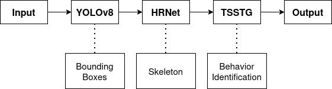

# Multi-Stage Cow Detection & Action Recognition

This repository provides a multi-stage inference pipeline that integrates three models:

- YOLOv8 — Object detection (to find cows in the frame)
- HRNet — Pose estimation (to locate keypoints on each detected cow)
- TS-STG — Action recognition (to classify each cow’s behavior)



The pipeline is modular: you can choose to run any combination of the three stages.

### Usage

Command-Line Interface (CLI)

The entry point is a Typer-based CLI defined in `predict.py`.

```bash
python predict_pipeline.py --option <stage> --image-path <path> [--device cpu|cuda] --show-skeleton/--no-show-skeleton
```

Sample command:

```bash
python predict_pipeline.py --option 1 --image-path img3.png --show-skeleton/--no-show-skeleton
```

###### Arguments

| Argument          | Type  | Required | Default | Description                                                                                        |
| ----------------- | ----- | -------- | ------- | -------------------------------------------------------------------------------------------------- |
| `--option`        | `int` | yes      | —       | Selects pipeline stage: <br> `1`: YOLO only <br> `2`: YOLO + HRNet <br> `3`: YOLO + HRNet + TS-STG |
| `--image-path`    | `str` | yes      | —       | Path to the input image. Supports `.jpg`, `.jpeg`, `.png`, `.bmp`, `.webp`.                        |
| `--device`        | `str` | no       | `cpu`   | Device to run inference on (`cpu` or `cuda`).                                                      |
| `--show-skeleton` | `str` | no       | `True`  | Flag to render skeleton in final image                                                             |

### Pipeline Overview

##### Option 1 — YOLO Only

- Loads the YOLOv8 model (yolov8m.pt)
- Detects cows in the input image
- Draws bounding boxes around detected objects
- Saves visualization under `../results/vis_res/`

##### Option 2 — YOLO + HRNet

- Runs YOLO detection
- Extracts bounding boxes and runs HRNet pose estimation for each detected cow
- Overlays keypoint skeletons (pose visualization)
- Saves annotated image under `../results/vis_res/`

##### Option 3 — YOLO + HRNet + TSSTG

- Performs full pipeline:
  - YOLOv8 detection
  - HRNet keypoint estimation
  - TS-STG action recognition (e.g., standing, walking, lying)
- Draws bounding boxes, skeletons, and predicted action labels
- Saves results to `../results/vis_res/`

### Changing the weights

Inside `predict.py`, simply change the directories to specify which weights you wish to use.

```
YOLO_CKPT = "yolov8/weights/yolov8m.pt"
POSE_CONFIG = "hrnet/config/hrnet_w32_ap10k_256_256.py"
POSE_CKPT = "hrnet/weights/hrnet_w32_ap10k.pth"
ACTION_CKPT = "stgcn/weights/tsstg-model.pth"
```
