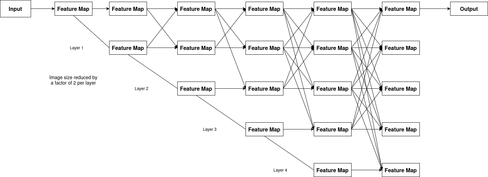

# HRNet Pose Estimation (AP-10K)

This repository provides a single-stage inference script for pose estimation using a
pretrained HRNet-W32 model on the AP-10K dataset:

- `hrnet_inference.py` - runs keypoint extraction on pre-cropped animal images (from
  YOLOv8 or any detector).

This produces per-image skeleton predictions and saves all results to a serialized
`.pkl` file for downstream use (e.g. ST-GCN).

## Usage

### Inference

`hrnet_inference.py` will:

- Load all cropped images from `data/input/`.
- Run HRNet pose estimation using pretrained weights (`weights/hrnet_w32_ap10k.pth`).

```bash
# Default usage
python hrnet_inference.py
```

Will generate:

- Keypoints per image.
  - Will appear as a list of dictionaries.
- Visualization images under `results/vis/`.
  - Each image under `results/vis/` shows:
    - Green lines for skeleton connections.
    - Red dots for detected keypoints
- A consolidated `keypoints.pkl` file under `results/`.

## HRNET Model Architecture



| **Module**                        | **What It Does**                                                                                                                                                                     |
| --------------------------------- | ------------------------------------------------------------------------------------------------------------------------------------------------------------------------------------ |
| **Input**                         | The original image or feature map enters the network.                                                                                                                                |
| **Feature Maps (Top Row)**        | The first branch keeps the **highest-resolution** features — it preserves fine spatial details (edges, textures, small shapes).                                                      |
| **Feature Maps (Lower Rows)**     | Each new row represents a **lower-resolution branch** that captures **broader, semantic context** (e.g., object shapes, regions). These are created by downsampling previous layers. |
| **Horizontal Connections**        | Show the **sequential flow** within each resolution — features are refined layer by layer.                                                                                           |
| **Diagonal/Vertical Connections** | Represent **multi-scale fusion**: each stage exchanges information across resolutions (high ↔ low) so fine details and broad context are blended together.                          |
| **Output**                        | After repeated fusions, all resolutions are combined to produce a final high-resolution output, rich in both detail and context.                                                     |
