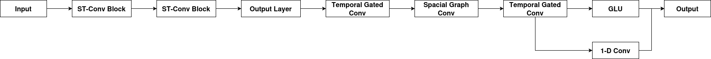

# ST-GCN Activity Prediction

This is a minimal inference CLI around an ST-GCN model for cow behavior classification.

- `train.py` — trains an ST-GCN on pose/keypoint data.
- `predict.py` — loads a trained TwoStreamSpatialTemporalGraph checkpoint and predicts
  one of: Stand, Walk, Run, Lay, Eat from pose keypoints.

It includes utilities to normalize keypoints to image size and per-pose scale before
feeding the network.

## Usage

### Inference

`predict.py` will:

- Load a Two-Stream ST-GCN checkpoint you provide (PyTorch `.pth`).
- Accept a single pose input (from an image’s keypoints) as a NumPy array.

```bash
# Basic: predict from a saved NumPy file (e.g., pts.npy with shape (parts, dims) or (1, parts, dims))
python predict.py --model-path models/tsstg_checkpoint.pth \
                  --pose-file /path/to/pts.npy \
                  --image-width 1920 --image-height 1080 \
                  --device cpu
```

It returns the predicted label to stdout.

### Training

A sample command to train the model:

```bash
python train.py \
  --epochs 30 \
  --batch-size 32 \
  --device cuda
```

| Arguments      | Type | Default     | Description                      | Simple                            |
| -------------- | ---- | ----------- | -------------------------------- | --------------------------------- |
| `--epochs`     | int  | `10`        | Number of training epochs.       | How many passes over the dataset. |
| `--batch-size` | int  | `32`        | Batch size.                      | How many samples per step.        |
| `--device`     | str  | `cpu`       | Compute device: `cpu` or `cuda`. | Where to run training.            |
| `--model-type` | str  | `onestream` | `onestream` or `twostream`.      | Choose model flavor.              |

## Importing infer from another module

If the package layout includes **init**.py files, `infer` can be imported
directly:

```python
import numpy as np
from predict import TSSTGInference

model_path = "models/tsstg_checkpoint.pth"
infer = TSSTGInference(model_path, device="cpu")

# pts: (parts, dims) or (1, parts, dims) or (frames, parts, dims); XY must be in pixel coords
pts = np.load("/path/to/pts.npy")
label = infer.infer(pts, image_size=(1920, 1080))
print(label)
```

## STGCN Model Architecture



| **Module**                     | **What It Does**                                                                                                                                                                                                    |
| ------------------------------ | ------------------------------------------------------------------------------------------------------------------------------------------------------------------------------------------------------------------- |
| **Input**                      | Takes in a sequence of data over time — for example, traffic speeds from many sensors or motion data from body joints.                                                                                              |
| **ST-Conv Block**              | The “core engine” of the model. Each block mixes time information (how things change) and spatial information (how different nodes or sensors are connected). It does this using Temporal and Spatial Convolutions. |
| **Output Layer**               | After several ST-Conv blocks have extracted deep spatio-temporal features, this layer turns those features into final predictions (e.g., next time-step traffic flow).                                              |
| **Temporal Gated Convolution** | Learns how things change over time using 1D convolutions along the time axis. The “gating” part helps the network focus on important changes and ignore noise.                                                      |
| **Spatial Graph Convolution**  | Learns how connected nodes (like roads or joints) influence each other using a graph structure. It passes messages between nodes based on their connections.                                                        |
| **GLU (Gated Linear Unit)**    | Controls how much information passes through. Think of it like an attention gate that filters useful features and blocks irrelevant ones.                                                                           |
| **1-D Convolution**            | A simple convolution applied over time — helps detect short-term trends or local temporal patterns.                                                                                                                 |
| **Output**                     | Produces the final prediction, such as future values for each node at the next few time steps.                                                                                                                      |
