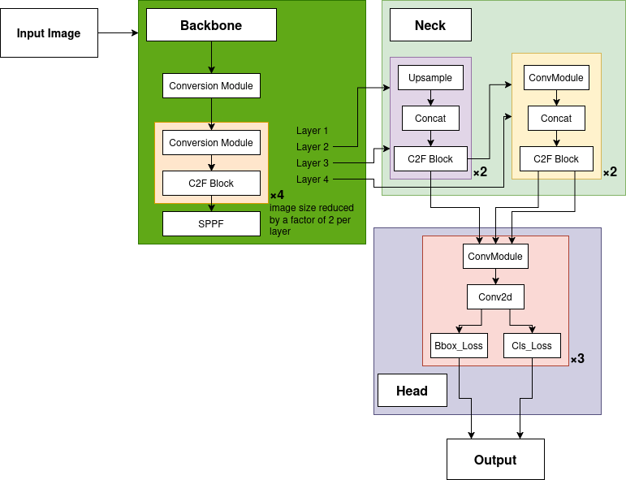

# YOLOv8: Training & Inference

This repository provides two convenience scripts for Ultralytics YOLOv8:

- `train.py` — trains a detector on a dataset in standard YOLO format.

- `predict.py` — runs inference on one image or all images in a folder.

The goal is a minimal, reproducible workflow with clear outputs and sensible defaults.

## Usage

### Inference

`predict.py` will:

- Load weights/yolov8m.pt by default.
- Accept `.jpg`, `.jpeg`, `.png`, `.bmp`, `.tiff`, `.gif`.

```bash
# Single image
python predict.py /path/to/image.jpg

# All images in a folder
python predict.py /path/to/folder
```

Will write predictions (images with boxes) under:

```bash
yolov7/results/run/
```

### Training

A sample command to be run to train the model.

```bash
python train.py /path/to/dataset \
  --weights weights/yolov8m.pt \
  --epochs 200 \
  --batch 16 \
  --imgsz 640 \
  --name exp1
```

| Arguments     | Type | Default              | Description                                                                            | Simple                                                                       |
| ------------- | ---- | -------------------- | -------------------------------------------------------------------------------------- | ---------------------------------------------------------------------------- |
| `dataset_dir` | str  | — (required)         | Path to dataset directory (YOLO format).                                               | Folder where your images/labels live.                                        |
| `--weights`   | str  | `weights/yolov8m.pt` | Initial checkpoint to start from.                                                      | Which model to start from.                                                   |
| `--imgsz`     | int  | `640`                | Training image size (square). Common choices: 416, 640, 768.                           | How big to resize images.                                                    |
| `--epochs`    | int  | `100`                | Number of training epochs.                                                             | How many times all data is used to train.                                    |
| `--batch`     | int  | `16`                 | Batch size per step. Tune to fit your GPU memory.                                      | How many images to concurrenly train at once.                                |
| `--device`    | str  | `None`               | Compute device: `'0'` (GPU id), `'0,1'` (multi-GPU), `'cpu'`, `'mps'` (Apple Silicon). | Specifies waht hardware to use to train.                                     |
| `--project`   | str  | `results/training`   | Root folder for run outputs (weights, logs, plots).                                    | Top-level output folder.                                                     |
| `--name`      | str  | `run`                | Subfolder name for this run.                                                           | Folder name for this experiment.                                             |
| `--workers`   | int  | `8`                  | Dataloader worker threads. Reduce on Windows if you see hangs.                         | How many helpers to increase training speed (adjust based hardware).         |
| `--patience`  | int  | `50`                 | Early-stopping patience (epochs without val improvement).                              | Limit to stop early if training not improving.                               |
| `--seed`      | int  | `0`                  | Random seed for reproducibility.                                                       | Removes "randomness", keeps results repeatable. Like a minecraft world seed. |

###### Memory tips (GPU OOM)

If CUDA out of memory occurs:

- Reduce batch size, e.g. --batch 8 or --batch 4.
- Use a smaller model, e.g. --weights yolov8n.pt or yolov8s.pt.
- Reduce image size, e.g. --imgsz 512.

###### View Training Results (Graphs)

```bash
# Option A: point to a run directory (containing results.csv)
python plots.py /path/to/results/training/exp1 --smooth 5

# Option B: point directly to results.csv
python plots.py /path/to/results/training/exp1/results.csv --smooth 5
```

This will write the loss results from training to `./results/training/exp1/plots/` or
the specified directory.

## Dataset Layout (YOLO format)

This is the expected format of the training data.

```
<dataset_root>/
  ├─ train/
  │   ├─ images/*.jpg|png|bmp|tif|tiff
  │   └─ labels/*.txt            # one file per image; "class cx cy w h" per line
  ├─ val/
  │   ├─ images/*.jpg|png|bmp|tif|tiff
  │   └─ labels/*.txt
  └─ data.yaml  (optional)
```

## Importing run_inference from another module

If the package layout includes **init**.py files, `run_inference` can be imported
directly:

```python
from ultralytics import YOLO
from cow_detectection.modeling.yolov8.predict import run_inference

model = YOLO("weights/yolov8m.pt")
output = run_inference(model, "/path/to/image.jpg")
```

> [!NOTE]
> If output_dir is empty ("" or None), it won’t save images; otherwise it saves
> under the specified directory.

## YOLOv8 Model Architecture



| **Module**      | **What It Does**                                                                                                                                                                                                                                                                                                                                                            |
| --------------- | --------------------------------------------------------------------------------------------------------------------------------------------------------------------------------------------------------------------------------------------------------------------------------------------------------------------------------------------------------------------------- |
| **Input Image** | The original image that gets analyzed (e.g., 640×640 pixels). It’s the raw visual data that YOLOv8 uses to detect objects.                                                                                                                                                                                                                                                  |
| **Backbone**    | Acts like the **feature extractor** — it converts the input image into a set of detailed features (edges, shapes, textures). Each layer (1–4) reduces the image’s size by half but increases its depth, learning progressively more abstract features. The `SPPF` (Spatial Pyramid Pooling Fast) helps capture both local and global context efficiently.                   |
| **Neck**        | This is the **feature fusion** stage. It takes the multi-scale feature maps from the Backbone, upsamples them, and merges them using concatenation and convolution. This allows the network to combine fine details (small objects) with coarse context (large objects). The `C2f` blocks here refine the fused features for better object localization and classification. |
| **Head**        | The **detection stage**. It predicts bounding boxes, object classes, and confidence scores. YOLOv8 uses a _decoupled head_, meaning separate branches for bounding box regression (`BBox_Loss`) and classification (`Cls_Loss`), which helps the model learn more efficiently.                                                                                              |
| **Output**      | Produces the final detected objects — including bounding boxes, labels, and confidence levels — after filtering via Non-Maximum Suppression (NMS).                                                                                                                                                                                                                          |
